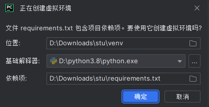

## 创作不易，请给我点个star吧~

# 作用
每到考试后，关心成绩的同学就需要很麻烦的一次又一次查看成绩出了没有，非常麻烦

使用本系统，你可以将它部署在电脑或服务器上（学校教务系统屏蔽了GitHub所以不能使用GitHub Action）
，后续每当出新成绩时，你都可以收到微信的推送，非常方便


# 使用方法

推荐使用IDE：Pycharm

## 必要步骤

### 下载本仓库的代码

下载方法1：使用`git`

下载方法2：直接在`GitHub`下载 选择`Code`然后点击`Download ZIP`

### 下载依赖

使用pycharm打开本项目后，默认的会弹出创建虚拟环境的提示，确认即可，如图：


### 设置账户信息

目前仅支持微信推送：打开pushplus的官网`https://www.pushplus.plus/`

使用微信扫码登入，并关注公众号（成绩推送就是通过公众号推送）

进入公众号后还需要点击官方链接授权登入

微信公众号内右下角`功能`->`个人中心`->`开发设置`->`Token`->`一键复制`

记住这个token，然后再去学校教务系统网站确认好自己账号密码

打开`user.json`按照下面格式书写：
假设教务系统账号为`admin` 密码为`123456` 微信公众号的token为`VIVO50KFC`

```
{
    "admin": {
        "psw" : "123456",
        "token" : "VIVO50KFC"
    }
}
```
还可以帮你的好朋友一起推送，那就继续增添即可：
假设ta的教务系统账号为`wangergou` 密码为`88888888` 微信公众号的token为`jinitaimei`
```
{
    "admin": {
        "psw" : "123456",
        "token" : "VIVO50KFC"
    },
    "wangergou": {
        "psw" : "88888888",
        "token" : "jinitaimei"
    }
}
```

### 初始化运行
项目通过`mark.json`来存储之前的成绩信息，默认是没有自带的，需要运行一次程序生成

运行命令`py main.py`或者使用pycharm的按钮运行`main.py`或者右键->`运行main`

正常情况下会输出：`mark.json文件不存在，现在已创建，请重新运行`

出现错误可查看后面关于异常的部分

### 正式运行
再次运行`main.py`

程序会顺序遍历`user.json`中的账号

第一次获取到成绩并成功推送后控制台会输出： `首次推送成功`

此时微信会收到pushplus的公众号推送信息

恭喜，你已经成功运行起来了！！！

后面默认的每十分钟去教务系统获取一次成绩，有新的成绩出来就会推送到微信

## 可选
### 修改更新频率
打开`main.py`，修改程序前面的`rest_time`变量，比如改为半小时：
```
# 两次更新的时间间隔 单位：秒
rest_time = 1800
```

# 技术说明

## 程序文件说明

main.py: 主程序负责运行整体

tools.py：工具函数库

login.py: 登入以及cookie相关

## 数据说明

数据一律通过本地的json文件存储

config.json:存储爬虫配置文件

user.json:存储用户账号密码和pushplus的token（用于推送更新）

cookies.json:存储用户cookie